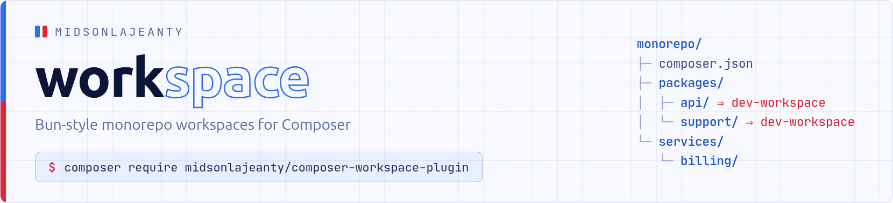

<p align="center">
    <picture>
        <source media="(prefers-color-scheme: dark)" srcset="art/header-dark.png">
        
    </picture>
</p>

<p align="center">
    <a href="https://github.com/midsonlajeanty/composer-workspace-plugin/actions">
        
    </a>
    <a href="https://packagist.org/packages/midsonlajeanty/composer-workspace-plugin">
        
    </a>
    <a href="https://packagist.org/packages/midsonlajeanty/composer-workspace-plugin">
        
    </a>
    <a href="https://packagist.org/packages/midsonlajeanty/composer-workspace-plugin">
        
    </a>
</p>

Bun-style monorepo workspaces for Composer

## Features

- **No `repositories` blocks.** Workspace libraries are auto-registered as
  symlinked path repositories the moment Composer runs anywhere inside the
  monorepo.
- **A workspace version tag.** Every workspace library resolves as
  `dev-workspace`, so a member can declare `"acme/support": "dev-workspace"`
  - a valid constraint that can only ever be satisfied locally, never by
  Packagist.
- **Fan-out commands.** Run scripts and Composer project-management commands
  across every member from the root: `composer ws run test`,
  `composer ws update`, `composer ws require`, …

## Getting started

Install globally so the plugin is active for every `composer install` run
anywhere inside your monorepo (do the same in CI):

```
composer global require midsonlajeanty/composer-workspace-plugin
composer global config allow-plugins.midsonlajeanty/composer-workspace-plugin true
```

Or require it in the monorepo root only fan-out commands then work from the
root, and member installs driven by `composer ws install` inherit it.

## Usage

### Declaring a workspace

The workspace root is any `composer.json` declaring member globs under
`extra.packages`:

```json
{
    "extra": {
        "packages": [
            "./packages",
            "./services"
        ]
    }
}
```

Every immediate child of those directories containing a `composer.json` is a
workspace member. Members of type `project` (applications) are never published
as dependencies; everything else (libraries, plugins) is auto-registered.

The root is discovered by walking up from the current directory, like git
discovers `.git`. In containers or other layouts where the monorepo structure
is not preserved, point the plugin at the root explicitly:

```bash
export COMPOSER_WORKSPACE_ROOT=/var/monorepo
```

### Depending on workspace libraries

Inside any member, just require the library - no `repositories` entry needed:

```json
{
    "require": {
        "acme/support": "dev-workspace"
    }
}
```

`@dev` constraints also resolve against the workspace. The packages are
symlinked, so edits to a library are live in every consumer instantly.

### Fan-out commands

Besides `list` and `run`, **any Composer command** is proxied to every member.
Commands run in-process (no subprocess, no re-bootstrap, memory reclaimed
after each member) and flags are forwarded verbatim - no `--` separator
needed:

```bash
composer ws list                                  # members and their scripts
composer ws run test                              # run a script everywhere it exists
composer ws run lint --filter=packages/*          # glob filter, repeatable
composer ws install                               # composer install in every member
composer ws update --with-all-dependencies        # flags forwarded as-is
composer ws update phpstan/phpstan                # one package, everywhere
composer ws require spatie/laravel-data           # add a dependency
composer ws require rector/rector --dev --filter=audit
composer ws remove laravel/pao --dev
composer ws dump-autoload --optimize
composer ws outdated
composer ws audit                                 # any Composer command works
composer ws run test --continue-on-error          # don't stop at the first failure
```

`--filter` and `--continue-on-error` belong to `ws` and are not forwarded;
everything else reaches the proxied command untouched.

## Contributing

You have a lot of options to contribute to this project ! You can :

- [Fork](https://github.com/midsonlajeanty/composer-workspace-plugin) on Github
- [Submit](https://github.com/midsonlajeanty/composer-workspace-plugin/issues) a bug report.
- [Donate](https://paypal.me/midsonlajeanty) to the Developper

## License

MIT
