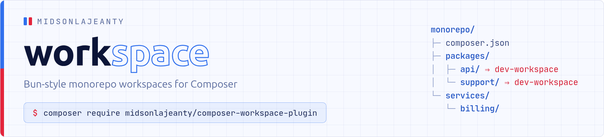

<p align="center">
    <picture>
        <source media="(prefers-color-scheme: dark)" srcset="art/header-dark.png">
        
    </picture>
</p>

<p align="center">
    <a href="https://github.com/midsonlajeanty/composer-workspace-plugin/actions">
        
    </a>
    <a href="https://packagist.org/packages/midsonlajeanty/composer-workspace-plugin">
        
    </a>
    <a href="https://packagist.org/packages/midsonlajeanty/composer-workspace-plugin">
        
    </a>
    <a href="https://packagist.org/packages/midsonlajeanty/composer-workspace-plugin">
        
    </a>
</p>

Bun-style monorepo workspaces for Composer.

> **Pre-1.0.** The plugin works and is tested, but the configuration shape is
> still settling. On `0.x` every minor release may change behaviour - pin
> `^0.1` and read the changelog before bumping.

## Why

A Composer monorepo normally means hand-maintaining a `repositories` block in
every member that needs a sibling, then installing directory by directory in the
right order. This plugin removes both chores:

- **No `repositories` blocks** - libraries are auto-registered as symlinked path
  repositories, published as `dev-workspace`.
- **One command for the whole repo** - `composer ws update`, `ws run test`,
  `ws require`, any Composer command, everywhere.
- **Dependency-aware** - members run after the libraries they depend on; a cycle
  aborts with an explicit error.
- **Parallel where it is safe** - independent members run at the same time;
  scripts and shared VCS mirrors are serialised unless you opt in.

## Install

Requires PHP 8.3+ and Composer 2.3+.

```bash
composer global require midsonlajeanty/composer-workspace-plugin
composer global config allow-plugins.midsonlajeanty/composer-workspace-plugin true
```

> The global install is **required**, not a convenience. Composer only loads
> plugins from the current project's `vendor/` and from the global one, so a
> Composer process running inside a member never sees a plugin installed in the
> monorepo root. Do the same in CI.

## Quickstart

Point the root `composer.json` at the directories holding your members - every
immediate child containing a `composer.json` becomes one:

```json
{
    "extra": {
        "workspace": {
            "members": ["./packages", "./apps"]
        }
    }
}
```

```
my-monorepo/
├── composer.json        ← the workspace root
├── packages/
│   ├── support/         → acme/support   (library, auto-registered)
│   └── logging/         → acme/logging   (library, auto-registered)
└── apps/
    └── api/             → acme/api       (type: project, never published)
```

Members require each other by name - no `repositories` entry:

```json
{
    "name": "acme/api",
    "require": {
        "acme/support": "dev-workspace"
    }
}
```

Then run `composer ws install` from the root. `@dev` resolves against the
workspace too, and members are symlinked, so an edit to a library is live in
every consumer instantly.

## Commands

Besides `list` and `run`, **any Composer command** is proxied to every member,
flags forwarded verbatim - no `--` separator needed:

```bash
composer ws list                              # members and their scripts
composer ws run test                          # run a script everywhere it exists
composer ws run lint --filter=packages/*      # only matching members
composer ws install                           # install every member
composer ws update --with-all-dependencies    # flags forwarded as-is
composer ws update phpstan/phpstan            # one package, everywhere
composer ws require spatie/laravel-data       # add a dependency
composer ws remove laravel/pao --dev
composer ws dump-autoload --optimize
composer ws outdated                          # any Composer command works
```

Three flags belong to `ws` itself and are never forwarded:

| Flag | Effect |
| --- | --- |
| `--filter=<glob>`, `-f` | Only members whose name or path matches. Repeatable. |
| `--continue-on-error` | Keep going after a member fails instead of stopping. |
| `--concurrency=N` | Members to run at once. Defaults to CPU cores capped at 8; `1` is sequential. |

## Configuration

Everything lives under one `extra.workspace` object.

| Key | Purpose |
| --- | --- |
| `members` | Globs pointing at the directories that hold members. |
| `propagate` | Opt into automatic fan-out (see below). |
| `parallel` | Scripts `ws run` may fan out concurrently (see below). |
| `COMPOSER_WORKSPACE_ROOT` | Env var pinning the root explicitly (not a config key). |

**Automatic fan-out.** By default a root-level `composer install`/`update` only
touches the root. Opt in and it reaches every member without going through
`composer ws` - `true` for both commands, or a list like `["install"]` for one:

```json
{ "extra": { "workspace": { "propagate": true } } }
```

`require`/`remove` never propagate, and the fan-out is guarded against recursion.

**Parallel scripts.** `ws run` is sequential by default: scripts are your code
and routinely share a database, a port or a cache. Name the ones that are safe
to run side by side - `true` for all of them, or a list:

```json
{ "extra": { "workspace": { "parallel": ["lint", "test:types"] } } }
```

`--concurrency` still wins either way, so `--concurrency=1` forces a listed
script back to sequential.

**Root discovery.** The root is found by walking up from the current directory,
the way git finds `.git`. Where that layout is not preserved (containers), pin
it: `export COMPOSER_WORKSPACE_ROOT=/var/monorepo`.

> **Upgrading from 1.x:** the globs moved. `extra.workspaces` and the older
> `extra.packages` are gone - put them in `extra.workspace.members` instead.
> The plugin says so on startup if it finds either.

## How it works

**Path repositories.** Each library member is prepended as a symlinked path
repository published as `dev-workspace` - a constraint only ever satisfiable
locally, never by Packagist. Members of type `project` are skipped, so
applications are never published as dependencies.

**Dependency layers.** Members are grouped into layers depending only on earlier
layers. A layer runs concurrently and the next starts once it is drained, so
dependencies are always installed first. Concurrency defaults to the CPU count
capped at 8 - Composer is I/O bound, and past a handful of processes the extra
ones just fight over the same disk. Each member's output is buffered and printed
as one block when it finishes, with a live line showing what is in flight.

**Process isolation.** Every member runs in its own Composer subprocess, so
scripts, plugins and autoloaders never leak between members.

**Shared VCS mirrors.** Composer clones every VCS repository into a mirror in
its global cache and takes no lock on it - two processes cloning the same
repository at once wipe each other's clone. Members are scanned for `vcs`-style
`repositories` entries and for the `source` of any inline `package` entry, and
two members that would touch the same mirror are never launched together. Everything else in the layer still runs in parallel.
A member whose `config.preferred-install` asks for source installs may clone
anything, so it runs on its own; `--prefer-source` does the same for the whole
run.

> `composer ws run <script>` stays **sequential** unless you pass
> `--concurrency` or list the script in `extra.workspace.parallel`: scripts are
> arbitrary user code and often share a database, a port or a cache. Composer's
> own commands write only to their own member's `vendor/`, so they always fan
> out.

## Contributing

You have a lot of options to contribute to this project! You can:

- [Fork](https://github.com/midsonlajeanty/composer-workspace-plugin) it on GitHub
- [Submit](https://github.com/midsonlajeanty/composer-workspace-plugin/issues) a bug report
- [Donate](https://paypal.me/midsonlajeanty) to the developer

## License

MIT
